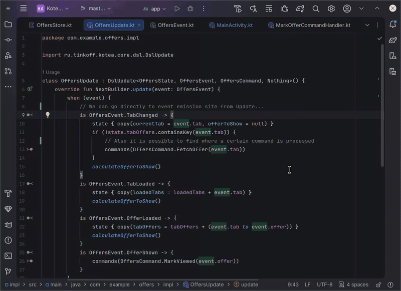

# KoTEA Companion Plugin

This repository is an IDE plugin for projects that use [the KoTEA library](https://opensource.tbank.ru/mobile-tech/KoTEA).
Its goal is to simplify navigation in a codebase that uses KoTEA.

## The Problem

The `Store`'s created with KoTEA are quite scattered across different files:
* The central `Update` entity (similar to a Reducer) processes events and dispatches commands.
* `Event`'s are sent from UI components.
* Each `Command` is handled by a dedicated `CommandsFlowHandler`, each one in its own file.

It's hard to navigate through it. Built-in IDE tools are insufficient to quickly check where a specific event was sent from or where a specific command is processed.
The plugin goal is to help with that.

## Key Features

The plugin basically has one main feature: It provides a set of actions to navigate to events emission sites and processing sites.

The actions are triggered by clicking gutter icons and invoking hotkeys. 

These actions are available for `Commands` and `Events`.

## How does it work

At project startup, the plugin indexes all implementations of `ru.tinkoff.kotea.core.Update`. Their generic arguments
are resolved as root classes for Events, Commands and News. These are called Roots. For each subclass of a Root,
the plugin adds a gutter icon and hotkey actions.

## Known Issues / Limitations

* Each class is resolved to a single KoTEA entity. For example, if a class implements both Command and News, it is 
  considered as News. The role is resolved by the closest superclass.
* [SAM-lambda](https://kotlinlang.org/docs/fun-interfaces.html#sam-conversions) implementation of 
  `ru.tinkoff.kotea.core.Update` are not indexed. Their generic type arguments will not be recognized as KoTEA entities.

## Installation

1. Download the latest `.zip` file from the Releases page.
2. Open your IDE (Android Studio or IntelliJ IDEA).
3. Navigate to **Settings / Preferences** > **Plugins**.
4. Click the gear icon (⚙️) at the top and select **Install Plugin from Disk...**
5. Choose the downloaded `.zip` archive and click **OK**.
6. Restart your IDE to activate the plugin.
